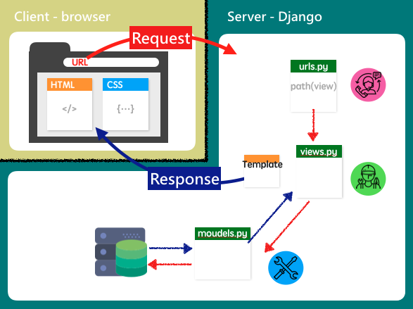

# CSX0013

## Introduce Myself

Hi 我是 bess，是校外的旁聽生～～～


## Week1+2

**Add html,css file to build message board**

heroku網站連結：
https://besshelloworldtest.herokuapp.com/

## Week3

1. 了解 Django Template 架構
2. 在 project 中新增 App，之後做成 
3. 學習 python，用 list + for迴圈產生照片在 ALBUM 頁面

## Week4+5

1. 了解 Django 如何連接 database
2. 在 models.py 設定需要的表格格式
	* 建立了 Blog 可以使用的table => Article
3. 在 BLOG 中顯示 Article 中的內容作為文章列表

**記得新增 colume 時要再 migrate!**

## Week6+7+8

#### Learning
#####一、 Django Template 運作方式


#####二、 資料傳送？Request？
* `<form>` 定義data如何傳送
* **action** 屬性：決定data要送到哪
	* e.g. `<form action="/somewhere_else">` data傳送到
* **method** 屬性：data傳送的方式，最常用`GET`、`POST`
	* **GET**: 像是明信片，會將資料顯示在URL上被別人看到～
	* **POST**: 像是有信封的信件，資料不會跟地址一起露在外面，「相對」安全

#### Doing
#####一、 在Blog中，像 medium 可以無限拍手的 Btn 
* ==問題==：用 `<form>` 以 `POST` 傳送，在「重新整理」的時候拍手數也會增加

**html**

```
<form action="" method="post">
  
  {{ form }}
  <input type="submit" value='claaaap'>
</form>
```


**views.py**

```
def article_detail(request,slug):
	article = Article.objects.get(slug=slug)
	if request.method == 'POST':
		article.clap_num += 1
		article.save()
	return render(request,'articles/article_detail.html',{'article':article})
```
